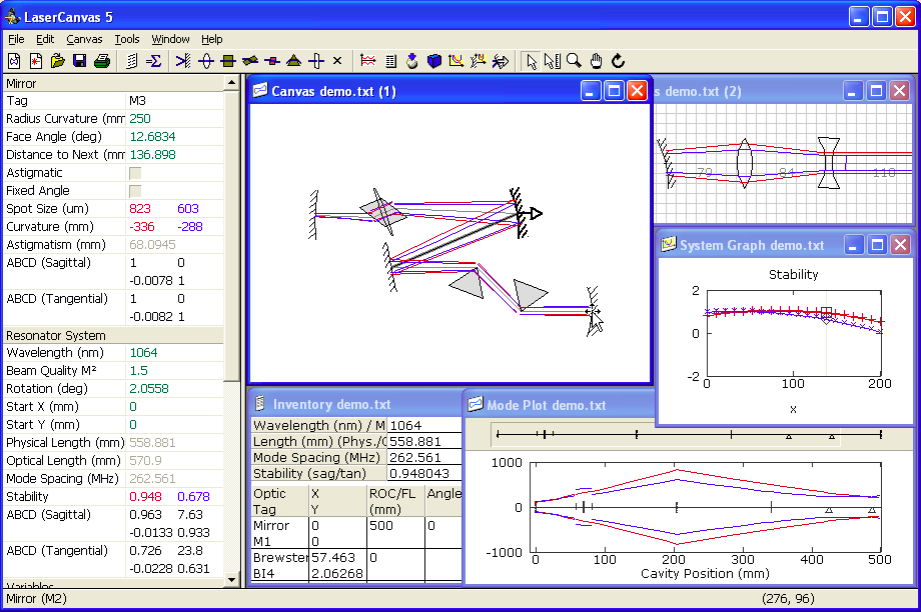

# LaserCanvas

An interactive modeling / teaching tool for designing laser resonators and
optical systems. Real-time ABCD matrix calculations display the resonated cavity
mode while moving optics around on the Canvas, where optics are shown exactly
where they would be on an optical table.

The application uses Win32 to provide a highly interactive tool that includes
resonator and propagation systems, systems connected via output coupler,
variables, numerical solver to minimize constraints.
